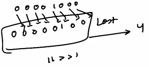
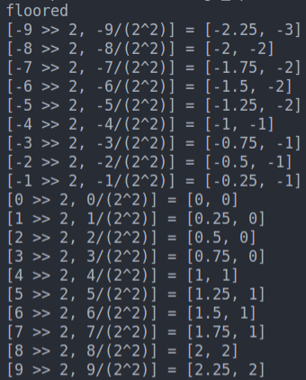

# 1. Shift Operators
Created Sunday 28 June 2020

The basic ops for bits are shifts, there are two kinds:

### Left shift

* Left most bit(s) are lost.
* Value added to the right are zeroes(0), always.
* Syntax:
```c++
x << 1;
2 << 1;
```


* Significance of left shift: Multiplication by 2^k^.


### Right shift

* Right most bit(s) are lost.
* Value added to the left is 0 for positive and 1 for negative, i.e sign retained.
* Syntax:
```c++
x >> 1;
8 >> 1;
```
 

* Significance of right shift: Division by 2^k^, **floor** value.



*****

Note: Shift behaves the same in all languages, because shifting is mathematical.

