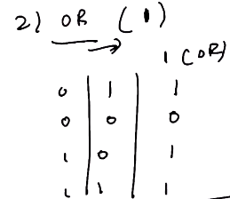
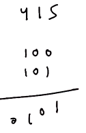
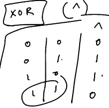

# 2. Remaining Bitwise Operators
Created Sunday 28 June 2020


* **Bitwise ops: **The operators which perform the logical gate operations on corresponding bits of two variables.

__Note:__

1. These are different from &&, || and ! which are meant for booleans only.
2. All 4 ops are commutative, associative and distributive.


Types of gate bitwise ops:

1. AND ⇒ &

 

* Uses:
	1. Turn off bit
	```c++
	x & 0 == 0; //true for any number
	// e.g 110 , turn off second bit
	// 110 & 101
	```

2. Check if bit is set/unset, inter-alia check if even or odd(no shifts required)
	```c++
	x & 1 = x; // check if a bit is set/unset
	```

2. OR ⇒ |

 

* Use:
	1. Set bit(s)
	```c++
	 x | 0 == x; // true
	 // 1010, turn on bit 1
	 // 101 | 0100 = 1110
	```

2. Check if bit is set/unset
	```c++
	x | 0 = x; // x is a bit
	```

3. NOT ⇒ ~ ⇒ unary operator


* Use:
	1. Unset bit(s)
	2. Produce all 1's
	```c++
	~0;// 11111111... useful
	0; // 0000.. obvious
	```

* Interesting and useful fact:
	```c++
	~x == -(x+1); // follows from the definition of 2's complement, given x is an integer
	```

4. XOR ⇒ ^ (The most useful)



* Use
	1. Check if two bits are equal
	```c++
	x ^ x == 0; // works for only two numbers(or even numbers)
	```

2. Works as binary switch for any bit
	```c++
	x ^ 1 = ~x; // same as ~x
	```

*****


1. **Predict The Output**
```c++
#include<iostream>
using namespace std;
int main(){
	if(~0 == 1) {
		cout << "yes";
	}
	else {
		cout << "no";
	}
}
```

1. yes
2. no
3. Compile time error
4. Undefined

Answer: B. ~0 = -(0+1) = -1 and not 1. Bitwise. not !


2. **Predict The Output**
```c++
#include <iostream>
using namespace std;
int main(){
    int y = 0;
    if(1 | (y = 1)) {
        cout << "y is " << y;
    }
    else {
        cout << y;
    }
}
```

1. y is 0
2. y is 1
3. 1
4. 0

Answer: B. Because in C++ an assigment has a value equal to the rvalue. So y==1 is the same as 1. This is allowed only in low level languages.


3. **Predict The Output**
```c++
#include <iostream>
using namespace std;

int main(){
   int y = 1;
   if(y & (y = 2))
      cout << "true";
   else
   cout << "false";
}
```
Answer: true

Reason: 32 is the answer in the assigment because no buffer is created.
in 2 & 3 ⇒ 2 and 3 both have different buffer variables.
in (y=2) & (y=3) ⇒ there are no buffer variables created, this is how assignment operator works. So is is like 3 & 3.
in  (y=3) & (y=2) ⇒ 2 & 2

