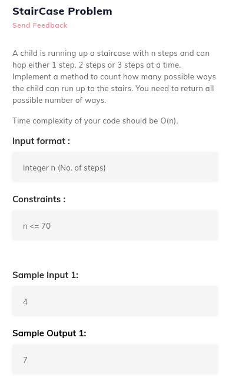
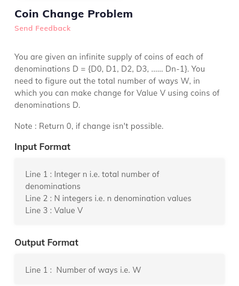
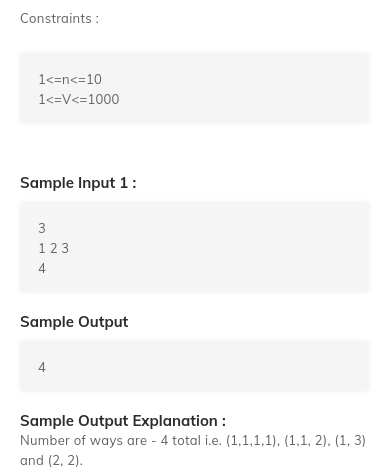

# 5. Coin change and stair case
Created Wednesday 01 July 2020

1. Staircase problem: Given n stairs, count the number of ways of going to the top using steps of 1, 2 and 3.
	* Let f(n) be the number of ways to traverse n steps.
	* Our **last** steps can be 1, 2 or 3.
	* So the total number of steps = f(n-1)*1 + f(n-2)*1 + f(n-3)*1 = f(n-1)+f(n-2)+f(n-3)
	* This is just like Fibonacci - Redundant work - O(n)
	* Skip the code.
	* Beware of the mathematical method here - It does not help, because order also matters here.
	* Order of steps matter here.

[staircase.cpp](5._Coin_change_and_stair_case/staircase.cpp)

2. Coin change problem: Given denominations D~0~, D~1~, D~2~ ... and a value n. Count the number of ways to make up n using the denominations.
	* Ending with coin denomination and solving like Staircase - wrong, order does not matter here.
	* For each coin, either it is used or it is not. And it may be used multiple times.
	* f(n, denArr, denom) = f(n-denarr[0], denarr, denom) + f(n, denarr+1, denom)
	* Denarr current head and denom(length) have a one-one relation, because we are decreasing denarr from left to right.
	* As each function is identified by n and denarr array, we'll need a 2d array of size = n+1 * denom+1
	* We can see that each denom can at max occupy n/denarr[i] space. So we can create an array of array. Space complexity will still be the same. n^2^ to n^2^/2.

 
[coinchange.cpp](5._Coin_change_and_stair_case/coinchange.cpp)

