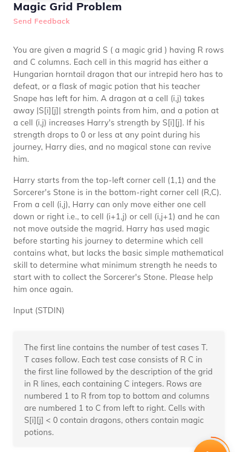
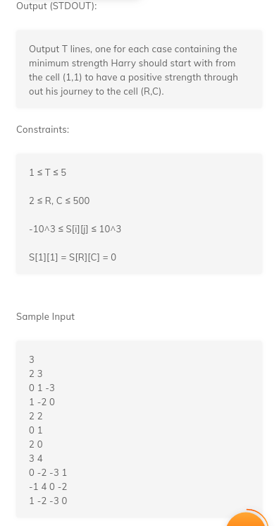

# 7. Magic Grid
Created Thursday 02 July 2020

   

*****

* Proof by construction is very important in DP. Dependencies are never reversed, the depedencies are made using other properties. No need to find a so-called inverse function.

[magicGrid.cpp](7._Magic_Grid/magicGrid.cpp)

