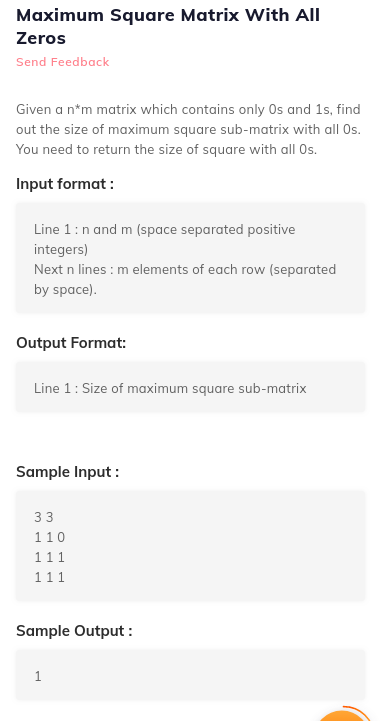
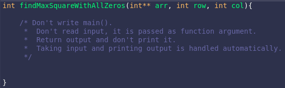

# 2. Maximum Square Matrix With All Zeros
Created Saturday 18 July 2020


```c++
//main code
#include<iostream>
#include"solution.h"
using namespace std;
int main()
 {
  int **arr,n,m,i,j;
  cin>>n>>m;
  arr=new int*[n];
  for(i=0;i<n;i++)
      {
       arr[i]=new int[m];
      }
  for(i=0;i<n;i++)
     {
      for(j=0;j<m;j++)
	    {
	     cin>>arr[i][j];
	    }
     }
  cout << findMaxSquareWithAllZeros(arr,n,m) << endl;
  delete arr;
  return 0;
}
// your code
int findMaxSquareWithAllZeros(int** arr, int row, int col){
    /* Don't write main().
     *  Don't read input, it is passed as function argument.
     *  Return output and don't print it.
     *  Taking input and printing output is handled automatically.
     */
}
```
