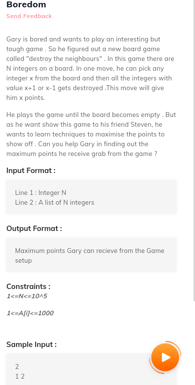
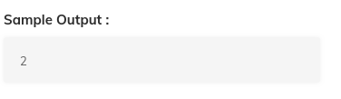

# 4. Boredom
Created Saturday 18 July 2020



```c++
// main code
#include<iostream>
#include<vector>
using namespace std;
#include "solution.h"
int n;
vector<int>A;
int main()
{
	cin>>n;
	for(int i=0;i<n;i++)
	{
		int x;
		cin>>x;
		A.push_back(x);
	}
	cout<<solve(n,A)<<endl;
}
// your coe
int solve(int n,vector<int>A){
  /* Don't write main().
     Don't read input, it is passed as function argument.
     Return output and don't print it.
     Taking input and printing output is handled automatically.
  */
}
```
