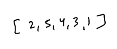

# 2. More about Bitmasking
Created Tuesday 28 July 2020

Suppose we are given this array:,we need to return the subsets which sum to k.

* Naive way is to generate the subsets, using recursion.
* But if we use bitmasking, we already have all our subsets. We can do **for(i=0; i < (1<<n)-1; i++)** and get our value, this requires no extra memory, but the time complexity is the same(although constant factor is much smaller). Check ith bit is also very easy, (mask & 1<<i==1)
* We avoided recursion and did it iteratively. Complexity n.2^n^, works if n<=16.

* The real power is comes when we use Dynamic Programming with Bitmasking.

