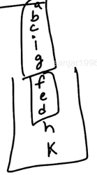

# 4. Strongly connected components
Created Sunday 26 July 2020

* A directed graph is said to be **strongly connected** if there's a path between all pairs of vertices.
* strong connectedness is valid only for directed graphs.

**Strongly connected component(SCC)**
An SCC is a **maximal strongly connected subgraph**. 

In other words: A connected subgraph where all pairs of vertices have a path between them, such that no larger(i.e containing more vectices) connected subgraph is possible containing the same vertices.

SCCs can be thought of as **self-contained** **cycles**.

Example of SCCs

**Note**

* A single vertex is considered strongly connected.
* Each strongly connected component is actually a DAG.

*****

17. How to find SCCs for a give graph?
18. Kosaraju's algorithm - Returns strongly connected components of a directed graph.

### Kosaraju's Algorithm

1. Perform DFS and store completely visited vertex in a stack.
2. While doing DFS, [transpose](https://en.wikipedia.org/wiki/Transpose_graph) the graph(All in-edges become out-edges and vice-versa).
3. Perform DFS w.r.t the stack. A new component is created for a popped unvisited element, else just popped.

Done!

*****

### How does Kosaraju's algorithm work?

1. In our stack, top will be filled by vertices from a component with an outgoing edge. This is for sure going to happen. Property of DFS and our stack selection.
2. In the transpose the outgoing will become in-edges. So the components(with vertex near the top) will be caught. The other component vertices are now open. But all others are now visited. The components are therefore fully isolated.

*****

T.C  → Same as DFS → O(V)

