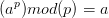
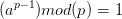
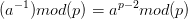

# 4. Fermat's Little Theorem
Created Sunday 02 August 2020

* Used very frequently.

* **For a number 'a' and a prime 'p' ** a.s.a 
* Where is it used? To find multiplicative inverse in a prime environment, using modular exponentiation.

