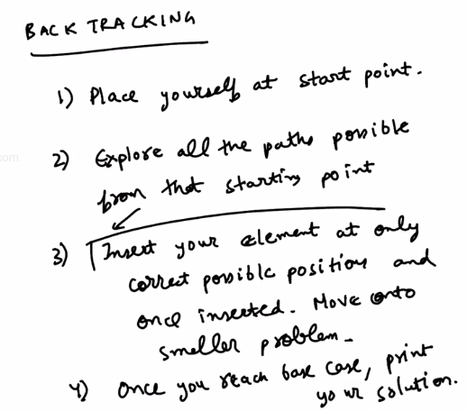

# 1. BackTracking
Created Monday 22 June 2020

**Lecture:**

* Backtracking is an approach where we explore all possible paths.

e.g There are 10 bags with some items.
Print the name on the bag if a ball exists in the bag.

* Backtracking is a kind of thinking(approach), not an algorithm.
* Backtracking and recursion are different. Backtracking is an approach and recursion is the algorithm used to solve the problem.
* Backtracking is implemented using recursion.

*****

N Queens Problem:
Given an NxN grid and N queens, following the rules of chess. We need to place the queens such that no queen is able to attack any other queen. Find and print the ways in which this is possible.

How to approach this problem:

1. Place the queens one by one.
2. After placing some queens, place a queen out from the killzone of the queens.
3. If a queen becomes unplaceable, change the queen which came before this - the previous queen caused the problem.
4. Keep doing this until we are able to place the queens effectively. We can confirm a configuration if all queens are placed correctly.
5. **Backtrack** even after a successful config. See what is possible, if the current queen was not placed here. **Do** Mark the current as marked.

Note: We end the search when we have seen all initial configurations.

*****

* For solving a problem which involves backtracking, first solve an example(not a very trivial one), then generalize.

