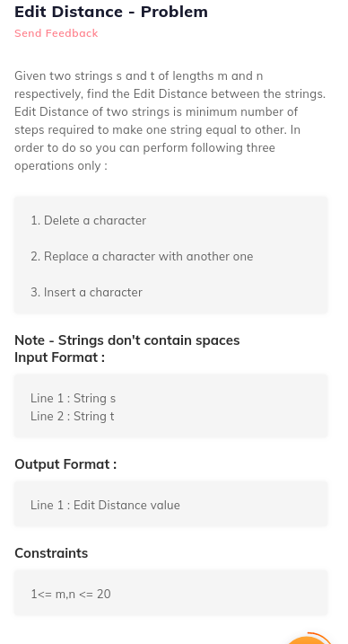
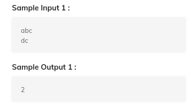

# 2. Edit Distance - Problem
Created Sunday 19 July 2020


```c++
//main code
#include "Solution.h"

int main(){
  string s1;
  string s2;

  cin >> s1;
  cin >> s2;

  cout << editDistance(s1,s2) << endl;
}

// your code
#include<iostream>
#include<cstring>
using namespace std;

int editDistance(string s1, string s2){
  /*  Don't write main().
   *  Don't read input, it is passed as function argument.
   *  Return output and don't print it.
   *  Taking input and printing output is handled automatically.
   */
}
```
