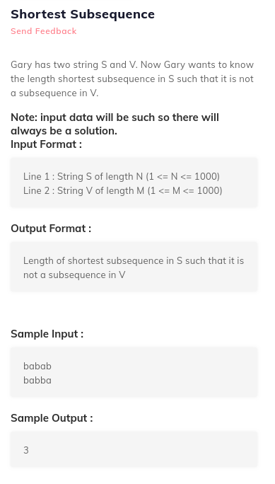

# 7. Shortest Subsequence
Created Sunday 19 July 2020


```c++
// main
#include<bits/stdc++.h>
using namespace std;

#include "solution.h"

int main()
{
	string S,V;
	cin>>S>>V;
	cout<<solve(S,V)<<endl;
	return 0;
}

//yourc code
int smallestSuperSequence(char str1[], int len1, char str2[], int len2) {
  /* Don't write main().
     Don't read input, it is passed as function argument.
     Return output and don't print it.
     Taking input and printing output is handled automatically.
  */
}
```
