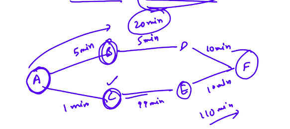

# 1. Introduction to Greedy technique
Created Sunday 19 July 2020

* It is technique, not an algorithm.
* What is it? - We try to optimize myopically at each step.

* It is applicable only if the next steps don't depend on the current step.
* If there is a dependency, then it is a dynamic programming problem.

* It is applicable in certain scenarios, and gives the best solution.
* The requirements for greedy solution is:

1. Optimal substructure - Choosing the optimal path for each step gives us the optimal answer to the whole problem.
2. Greedy workout - Greedy technique really works.

Examples using:

1. Sorting
2. Find maximum
3. Interval problems

*****

Example: We have some activities with their starting and ending time given. We need to choose activities such that number of activities chosen is maximum.
**Greedy Hunch**: Select the activity that ends the quickest, as this will leave room for the activities coming up ahead. And this works.

