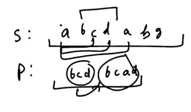

# 1. Pattern Matching Basics
Created Monday 27 July 2020

We need to tell if a given pattern exists in a given string.

### Naive Approach
We search one by one. We traverse the patter only if the starting letters match first. O(n*m) - This is the naive approach.

